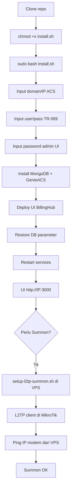

# genieacs-billinghub

GenieACS custom **BillingHub.id** — tema UI charcoal, logo BillingHub, overview dashboard, virtual parameters multi-vendor (ZTE, Huawei, FiberHome, CMCC), installer otomatis, dan panduan **Summon via L2TP** (VPS ACS ↔ MikroTik).

## Fitur utama

- UI dark/light mode, login & dashboard branded BillingHub
- Overview: status online, PON, optical RX, device brand, temperature
- Virtual parameters: RXPower, PPPoE, IP TR-069, WiFi password, uptime
- Provisions: ACS URL, Connection Request auth, periodic inform
- Support multi-vendor ONU/CPE
- Script L2TP Summon: ACS VPS = server, MikroTik = client (tanpa IP publik di MikroTik)

## Persyaratan

| Item | Detail |
|------|--------|
| OS | Ubuntu 20.04 / 22.04 / 24.04 (amd64) |
| Target | VPS / server / STB **fresh** (kosong) — ideal 1 mesin = 1 ACS |
| Akses | root / sudo |
| Port ACS | 7547 (CWMP), 7557 (NBI), 7567 (FS), 3000 (UI) |
| Port L2TP Summon | UDP **500**, **4500**, **1701** (buka di firewall VPS/cloud) |
| RAM | min. 2 GB |

> **Sudah ada ACS + data device?** Jangan full `install.sh` ulang. Pakai `scripts/sync-config.sh` atau ACS Studio (logo/warna) supaya data modem tidak ikut berisiko.

## Carta setup (alur instalasi)



## ACS Studio (lokal)

UI lokal untuk ganti logo + warna ACS di VPS via SSH:

```bash
cd theme-studio && npm install && npm run dev
```

Buka http://127.0.0.1:5173 — lihat `theme-studio/README.md`.  
Rollback: `git checkout pre-theme-studio`

## Instalasi cepat

```bash
git clone https://github.com/msramdan/genieacs-billinghub.git
cd genieacs-billinghub
chmod +x install.sh scripts/*.sh
sudo bash install.sh
```

Installer akan menanyakan:

1. Domain/IP ACS (contoh: `acs.example.com` atau IP VPS)
2. Port CWMP (default `7547`)
3. Username & password TR-069 (kosong = generate acak)
4. Password admin UI (kosong = samakan dengan TR-069)
5. Konfirmasi install — setelah selesai, setup Summon pakai **L2TP** (lihat bagian di bawah)

**Penting — kredensial:** jangan pakai password lemah / yang sama di semua pelanggan.  
Setelah install, **generate random** (UI = CWMP = NBI **sama**):

```bash
sudo BH_ACS_HOST=<IP-atau-domain> bash scripts/set-random-credentials.sh
# Hasil tersimpan di: /opt/genieacs/acs-credentials.env
cat /opt/genieacs/acs-credentials.env
```

## Setelah install

| Service | URL | Keterangan |
|---------|-----|------------|
| UI | `http://IP:3000` | login = user random |
| CWMP | `http://IP:7547` | TR-069 = **user/pass sama** |
| NBI | `http://IP:7557` | API = **user/pass sama** |

### Sync config (server sudah ada)

```bash
# Baca dulu kredensial random server ini
source /opt/genieacs/acs-credentials.env

sudo BH_ACS_HOST=$BH_ACS_HOST BH_ACS_USER=$BH_ACS_USER BH_ACS_PASS=$BH_ACS_PASS \
     BH_UI_PASS=$BH_UI_PASS bash scripts/sync-config.sh
```

Atau generate ulang:

```bash
sudo BH_ACS_HOST=<IP-atau-domain> bash scripts/set-random-credentials.sh
```

### Update UI saja (tanpa reinstall)

```bash
sudo bash scripts/deploy-ui-theme.sh
```

---

## Summon dari VPS ACS (L2TP ↔ MikroTik) — langkah demi langkah

### Kenapa perlu ini?

| Arah | Hasil tanpa VPN |
|------|-----------------|
| Modem → ACS (Inform) | ✅ Online (lewat internet) |
| ACS → Modem (Summon) | ❌ Gagal jika modem di belakang NAT / MikroTik tanpa IP publik |

**Tujuan Summon:** VPS ACS harus bisa **ping IP modem** (ConnectionRequestURL).  
Pola yang dipakai (aman untuk MikroTik **tanpa IP publik**):

```
Modem (10.10.10.x) ←→ MikroTik  ──L2TP client keluar──→  VPS ACS (L2TP server)
```

- VPS = **L2TP/IPsec server**
- MikroTik = **L2TP client** (connect ke IP publik VPS)
- UltraVPN / VPN lain di MikroTik boleh tetap jalan (interface terpisah)

> **Catatan:** MikroTik tanpa IP publik → L2TP client di MikroTik, L2TP server di VPS ACS (berlaku ROS 6 & ROS 7).

### Prasyarat

1. VPS ACS sudah install GenieACS BillingHub, punya **IP publik** (contoh `203.0.113.10`)
2. Firewall cloud VPS buka UDP **500, 4500, 1701**
3. Akses MikroTik (Winbox / API)
4. Tahu **subnet IP modem** (dari ConnectionRequestURL di GenieACS, atau pool PPPoE MikroTik)

### Step 1 — L2TP server di VPS ACS

```bash
cd /path/ke/genieAcs-billinghub

sudo BH_L2TP_PSK='GANTI_PSK_KUAT' \
     BH_L2TP_USER='acs-mt' \
     BH_L2TP_PASS='GANTI_PASS_KUAT' \
     BH_MODEM_SUBNETS='10.10.10.0/24,192.168.0.0/24' \
     bash scripts/setup-l2tp-summon.sh
```

- Ganti `BH_MODEM_SUBNETS` sesuai jaringan Anda (pisah koma jika lebih dari satu).
- Kredensial tersimpan di VPS: `/opt/genieacs/l2tp-summon.env` (jangan commit ke git).

Cek service:

```bash
systemctl is-active xl2tpd strongswan-starter
sudo ss -ulnp | grep -E '500|4500|1701'
```

### Step 2 — L2TP client di MikroTik

**Opsi A — Winbox / Terminal MikroTik:**

```
/interface l2tp-client
add name=l2tp-acs connect-to=<IP_PUBLIK_VPS_ACS> \
    user=acs-mt password=<BH_L2TP_PASS> \
    use-ipsec=yes ipsec-secret=<BH_L2TP_PSK> \
    add-default-route=no use-peer-dns=no \
    profile=default-encryption max-mtu=1400 max-mru=1400 \
    comment="BillingHub ACS Summon" disabled=no
```

Pastikan `R` (running) di interface `l2tp-acs`.

**Opsi B — Script API (dari PC yang bisa reach API MikroTik):**

```bash
pip install librouteros

export MT_HOST=vpn.contoh.id   # atau IP API
export MT_PORT=10002
export MT_USER=admin
export MT_PASS='...'
export ACS_IP=203.0.113.10
export L2TP_USER=acs-mt
export L2TP_PASS='...'         # sama BH_L2TP_PASS
export L2TP_PSK='...'          # sama BH_L2TP_PSK
export MODEM_SUBNETS='10.10.10.0/24,192.168.0.0/24'

python3 scripts/mikrotik-l2tp-acs-client.py
```

### Step 3 — Firewall forward di MikroTik (jika perlu)

Kalau ping dari ACS ke gateway modem OK tapi ke IP modem gagal, pastikan filter **forward** mengizinkan traffic dari `l2tp-acs` ke subnet modem (jangan di-drop).

Jangan src-NAT traffic ACS→modem jika tidak perlu (boleh bypass NAT untuk dst subnet modem).

### Step 4 — Tes dari VPS ACS

```bash
# Tunnel harus muncul
ip addr show ppp0
# Route subnet modem via peer tunnel
ip route | grep ppp0

# Ping gateway MikroTik di sisi modem / peer tunnel
ping -c 3 10.255.255.2          # IP MikroTik di tunnel
ping -c 3 10.10.10.1            # contoh gateway pool modem
ping -c 3 <IP_MODEM_DARI_ACS>   # IP di ConnectionRequestURL
```

Kalau **ping IP modem OK** → buka GenieACS UI → klik **Summon**.

### Troubleshooting Summon

| Gejala | Cek |
|--------|-----|
| `l2tp-acs` tidak Running | PSK/user/pass, UDP 500/4500/1701 di VPS, log MikroTik IPsec |
| IKE OK tapi Quick Mode `NO_PROPOSAL_CHOSEN` | Proposal ESP di `setup-l2tp-summon.sh` (sudah include `aes128-sha1-modp1024`) |
| Ping peer tunnel OK, ping modem gagal | Route/firewall forward di MikroTik; subnet `BH_MODEM_SUBNETS` salah |
| Ping modem OK, Summon tetap gagal | Port Connection Request di ONT; cek Faults di GenieACS |
| Inform Online, Summon tidak perlu | Task tetap jalan di Inform berikutnya (~200 detik) tanpa VPN |

### Install ulang di VPS baru + MikroTik baru (checklist)

1. Install GenieACS: `sudo bash install.sh` (atau `sync-config.sh`)
2. **Generate kredensial random:** `sudo BH_ACS_HOST=<IP> bash scripts/set-random-credentials.sh`
3. Buka UDP 500/4500/1701 di cloud firewall
4. `sudo bash scripts/setup-l2tp-summon.sh` (set PSK/user/pass + subnet modem)
5. Di MikroTik baru: buat `l2tp-client` ke IP VPS (step 2 L2TP)
6. Dari VPS: `ping` IP modem → Summon

Script terkait:

| Script | Fungsi |
|--------|--------|
| `scripts/setup-l2tp-summon.sh` | L2TP/IPsec **server** di VPS ACS |
| `scripts/mikrotik-l2tp-acs-client.py` | Buat L2TP **client** di MikroTik via API |
| `scripts/set-random-credentials.sh` | Generate user/pass random (UI=CWMP=NBI) |

---

## Struktur folder

```
genieacs-billinghub/
├── install.sh                 # installer utama
├── logo.png                   # logo header & login
├── genieacs/public/           # CSS, JS, theme-toggle
├── db/export/                 # snapshot MongoDB (config, VP, provisions)
├── db/virtualParameters/      # script VP multi-vendor
├── db/provisions/             # inform, refresh-wlan
├── lib/                       # logika generic (wifi connected)
├── tests/                     # unit test (npm test)
└── scripts/                   # deploy, patch, L2TP Summon, diag
```

## Scripts (produksi)

| Script | Fungsi |
|--------|--------|
| `sync-config.sh` | Samakan UI + DB params (hanya domain/IP beda) |
| `setup-l2tp-summon.sh` | L2TP server untuk Summon |
| `mikrotik-l2tp-acs-client.py` | L2TP client MikroTik via API |
| `deploy-ui-theme.sh` | Deploy tema + logo |
| `deploy-fix-rpc.sh` | Kurangi too_many_rpcs |
| `set-random-credentials.sh` | Generate user/pass random — UI=CWMP=NBI sama |
| `set-all-passwords.sh` | Set UI + TR-069 (manual user/pass) |
| `diag-device.mongosh.js` | Cek 1 perangkat |

## Konfigurasi ONU

Pakai kredensial dari `/opt/genieacs/acs-credentials.env` (hasil `set-random-credentials.sh`):

```
ACS URL   : http://<domain-atau-ip-acs>:7547
Username  : <BH_ACS_USER>     # contoh: bh_a3k9xm2q
Password  : <BH_ACS_PASS>     # random 20 karakter
Inform    : ~200 detik (via provision)
```

**Jangan** pakai password lemah atau kredensial yang sama di semua server pelanggan.

---

**BillingHub.id** — ACS Server Management
