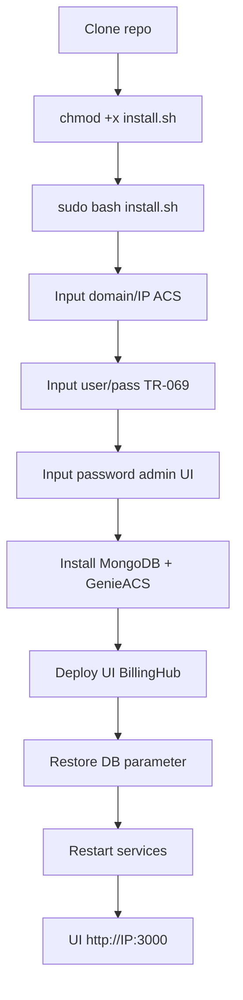

# genieacs-billinghub

GenieACS custom **BillingHub.id** — tema UI charcoal, logo BillingHub, overview dashboard, virtual parameters multi-vendor (ZTE, Huawei, FiberHome, CMCC), dan installer otomatis.

## Fitur utama

- UI dark/light mode, login & dashboard branded BillingHub
- Overview: status online, PON, optical RX, device brand, temperature
- Virtual parameters: RXPower, PPPoE, IP TR-069, WiFi password, uptime
- Provisions: ACS URL, Connection Request auth, periodic inform
- Support multi-vendor ONU/CPE

## Persyaratan

| Item | Detail |
|------|--------|
| OS | Ubuntu 20.04 / 22.04 / 24.04 (amd64) |
| Akses | root / sudo |
| Port | 7547 (CWMP), 7557 (NBI), 7567 (FS), 3000 (UI) |
| RAM | min. 2 GB |

## Carta setup (alur instalasi)



## Instalasi cepat

```bash
git clone https://github.com/msramdan/genieacs-billinghub.git
cd genieacs-billinghub
chmod +x install.sh scripts/*.sh
sudo bash install.sh
```

Installer akan menanyakan:

1. Domain/IP ACS (contoh: `acs.billinghub.id`)
2. Port CWMP (default `7547`)
3. Username & password TR-069 (default `msn` / `msn`)
4. Password admin UI
5. ZeroTier untuk NAT traversal (opsional)

## Setelah install

| Service | URL | Keterangan |
|---------|-----|------------|
| UI | `http://IP:3000` | login admin |
| CWMP | `http://IP:7547` | TR-069 ACS |
| NBI | `http://IP:7557` | REST API |

### Update UI saja (tanpa reinstall)

```bash
node scripts/build-logo.js    # jika ganti logo.png
node scripts/patch-pie-chart.js
node scripts/build-ui.js
sudo cp -r genieacs/public/* $(npm root -g)/genieacs/public/
sudo systemctl restart genieacs-ui
```

### Restore parameter DB

```bash
sudo bash scripts/restore-db.sh
sudo bash scripts/patch-inform.sh http://acs-domain:7547 7547 msn msn
sudo systemctl restart genieacs-{cwmp,fs,ui,nbi}
```

## Struktur folder

```
genieacs-billinghub/
├── install.sh                 # installer utama
├── logo.png                   # logo header & login (satu-satunya file logo)
├── genieacs/public/           # CSS, JS, theme-toggle, logo.png
├── db/export/                 # snapshot config MongoDB
├── db/virtualParameters/      # script VP
├── db/provisions/             # provision inform
└── scripts/                   # build UI, restore DB, patch
```

## Konfigurasi ONU

```
ACS URL   : http://<domain-acs>:7547
Username  : msn
Password  : msn
Inform    : 200 detik (via provision)
```

---

**BillingHub.id** — ACS Server Management
